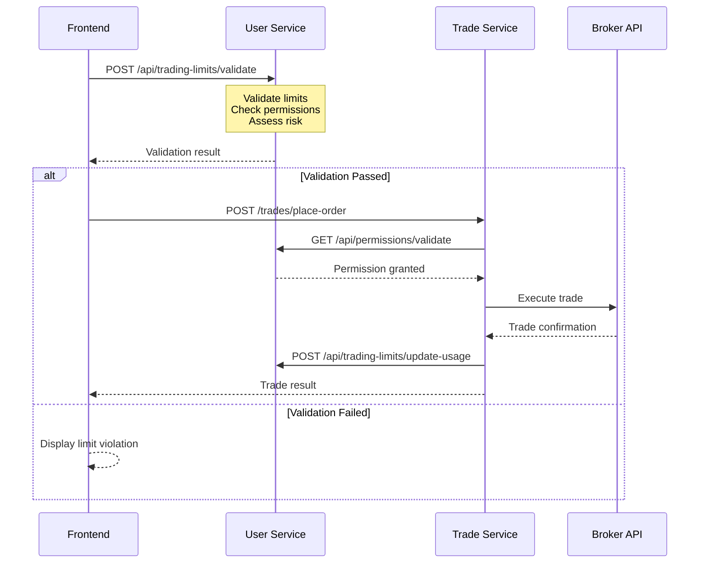

# Complete System Design: Trading Platform Architecture

## Executive Summary

This document provides a comprehensive overview of the multi-tenant trading platform architecture, detailing the separation of concerns between microservices, inter-service communication patterns, alerting mechanisms, and failure resilience strategies.

## Service Architecture Overview

### Core Services

#### **User Service** 🔐
**Port:** 8002  
**Primary Domain:** User Management & Risk Control

**Responsibilities:**
- User authentication & authorization (Keycloak integration)
- Organization & group management
- Trading limits & risk management
- Permissions & access control
- API key management for broker access
- User activity monitoring & audit trails

**Key Features:**
- JWT token validation with Keycloak
- Fine-grained trading limits (15+ limit types)
- Real-time limit validation
- Breach detection & alerting
- Emergency fallback permissions

#### **Trade Service** 📈
**Port:** 8004  
**Primary Domain:** Trade Execution & Market Data

**Responsibilities:**
- Trade execution & order management
- Market data synchronization
- Position & holdings management
- Broker API integration (AutoTrader)
- Real-time trading operations
- Strategy execution & monitoring

**Key Features:**
- Real-time order placement & tracking
- Market data feeds
- Position reconciliation
- Strategy management
- External order detection

## Service Communication Architecture

### 1. Synchronous Communication (HTTP APIs)

#### Pre-Trade Validation Flow


#### Service-to-Service Authentication
- JWT-based service tokens with 1-hour expiry
- Mutual TLS for enhanced security
- Circuit breaker pattern for resilience
- Automatic token refresh

### 2. Asynchronous Communication (Event-Driven)

#### Message Queue Topics
- `user.permissions.updated` - Permission changes affecting trading
- `user.limits.breached` - Trading limit violations
- `trade.executed` - Successful trade completion
- `trade.failed` - Trade execution failures
- `alert.critical` - System-wide critical alerts
- `system.health` - Service health status updates

#### Event Processing
```python
# Example: Trading limit breach event
{
  "event_type": "trading_limit_breached",
  "user_id": 123,
  "organization_id": 456,
  "limit_type": "daily_trading_limit",
  "breach_amount": 25000.00,
  "severity": "high",
  "actions_required": ["restrict_trading", "notify_admin"],
  "timestamp": "2024-01-15T14:30:00Z"
}
```

## Data Ownership Model

### Clear Boundaries

#### **User Service Owns:**
- ✅ User profiles & authentication data
- ✅ Organizations & group memberships  
- ✅ Trading limits & permissions
- ✅ API keys (hashed) for broker access
- ✅ User activity logs & audit trails
- ✅ Risk management configurations

#### **Trade Service Owns:**
- ✅ Trading accounts & broker connections
- ✅ Orders, positions, & holdings data
- ✅ Market data & price feeds
- ✅ Trade execution logs
- ✅ Broker API interactions
- ✅ Strategy execution data

#### **Shared Read-Only:**
- 📖 User → Trading Account mappings
- 📖 Organization → Trading Account relationships
- 📖 Basic user information for trade attribution

## Comprehensive Alerting System

### Alert Categories & Routing

#### **Trading Limit Alerts** (User Service)
```json
{
  "alert_type": "trading_limit_breach",
  "severity": "high",
  "title": "Daily Trading Limit Exceeded",
  "message": "User exceeded daily limit by ₹25,000",
  "delivery_channels": ["websocket", "email", "slack"],
  "escalation_rules": {
    "if_not_acknowledged": "30_minutes",
    "escalate_to": "organization_admin"
  }
}
```

#### **Trade Execution Alerts** (Trade Service)
```json
{
  "alert_type": "trade_execution_failed",
  "severity": "medium", 
  "title": "Order Execution Failed",
  "message": "Order ORD123456 failed: insufficient margin",
  "delivery_channels": ["websocket", "email"],
  "retry_policy": {
    "max_retries": 3,
    "backoff_multiplier": 2
  }
}
```

#### **System Health Alerts** (Both Services)
```json
{
  "alert_type": "service_degraded",
  "severity": "critical",
  "title": "Trade Service Degraded",
  "message": "Broker API connection timeout",
  "delivery_channels": ["slack", "email", "sms"],
  "immediate_action": true
}
```

### Multi-Channel Delivery

#### **Immediate Alerts (< 1 minute):**
- 🔌 WebSocket push notifications to UI
- 📧 Email alerts for critical breaches  
- 📱 SMS for system-wide outages
- 💬 Slack notifications for operations team

#### **Batch Alerts (Daily/Weekly):**
- 📊 Usage summary reports
- 📈 Performance analytics
- 🏥 Health check summaries
- 📋 Audit reports

### Alert Escalation Matrix

| Severity | Initial Response | Escalation (15 min) | Escalation (30 min) |
|----------|------------------|---------------------|---------------------|
| INFO     | WebSocket        | -                   | -                   |
| WARNING  | WebSocket + Email| Slack              | -                   |
| ERROR    | All channels     | Manager alert      | SMS notification    |
| CRITICAL | All + SMS        | Executive alert    | Incident call       |

## Failure Scenarios & Resilience

### 1. User Service Down

#### **Impact Assessment:**
- ❌ New user authentication blocked
- ❌ Trading limit validation unavailable  
- ❌ Permission checks fail
- ✅ Existing authenticated users can trade (cached tokens)
- ✅ Emergency limits activate automatically

#### **Mitigation Strategy:**
```python
@handle_user_service_unavailable
async def validate_user_permissions(user_id: int, action: str):
    try:
        # Primary: Call user service
        return await user_service_client.validate_permissions(user_id, action)
    except UserServiceUnavailableError:
        # Fallback 1: Use cached permissions (5-minute TTL)
        cached_permissions = await get_cached_permissions(user_id)
        if cached_permissions and not cached_permissions.is_expired():
            return cached_permissions.with_warning("Using cached permissions")
        
        # Fallback 2: Emergency limits
        return EmergencyPermissions(
            daily_limit=10000.00,      # Conservative limit
            single_trade_limit=2000.00, # Reduced risk
            allowed_actions=["place_order", "cancel_order"],
            valid_until="1 hour"
        )
```

### 2. Trade Service Down

#### **Impact Assessment:**
- ❌ Order placement blocked
- ❌ Position updates stopped
- ❌ Market data synchronization halted
- ✅ User management continues normally
- ✅ Limit validation works with stale data

#### **Mitigation Strategy:**
```python
@handle_trade_service_unavailable
async def validate_trading_limits(user_id: int, action: TradingAction):
    try:
        # Get current positions from trade service
        current_positions = await trade_service_client.get_positions(user_id)
    except TradeServiceUnavailableError:
        # Use last known positions with staleness warning
        current_positions = await get_cached_positions(user_id)
        if current_positions.is_stale(max_age=timedelta(minutes=10)):
            return ValidationResult(
                allowed=False,
                error="Trade service unavailable - cannot validate current positions",
                suggested_action="retry_in_minutes"
            )
    
    return validate_against_limits(user_id, action, current_positions)
```

### 3. Partial Service Degradation

#### **Circuit Breaker Implementation:**
```python
class CircuitBreaker:
    def __init__(self, failure_threshold=5, recovery_timeout=30):
        self.failure_threshold = failure_threshold
        self.recovery_timeout = recovery_timeout
        self.state = "CLOSED"  # CLOSED, OPEN, HALF_OPEN
    
    def can_execute(self) -> bool:
        if self.state == "OPEN":
            if time_since_last_failure > self.recovery_timeout:
                self.state = "HALF_OPEN"
                return True
            return False
        return True
```

#### **Retry Queue for Failed Operations:**
```python
class RetryQueue:
    def enqueue(self, operation):
        # Queue operation with exponential backoff
        # Retry intervals: 30s, 1m, 5m, 15m
        
    async def process_queue(self):
        # Process ready operations
        # Remove permanently failed operations
```

## Advanced Design Patterns

### 1. Saga Pattern for Distributed Transactions

```python
class PlaceOrderSaga:
    """Orchestrate order placement across services"""
    
    async def execute(self, order_data, user_context):
        saga_id = generate_saga_id()
        
        try:
            # Step 1: Reserve trading limit
            limit_reservation = await user_service.reserve_limit(
                user_context, order_data, saga_id
            )
            
            # Step 2: Execute trade
            trade_result = await trade_service.place_order(
                order_data, saga_id
            )
            
            # Step 3: Confirm limit usage
            await user_service.confirm_limit_usage(
                limit_reservation.id, trade_result
            )
            
            return trade_result
            
        except Exception as e:
            # Compensating actions
            await self.compensate_saga(saga_id, e)
            raise
```

### 2. Event Sourcing for Audit Trail

```python
class TradingEventStore:
    """Complete audit trail of all trading events"""
    
    async def append_event(self, event: TradingEvent):
        await self.event_store.append(
            stream_id=f"user-{event.user_id}",
            event_type=event.event_type,
            event_data=event.data,
            metadata={
                "service": event.source_service,
                "timestamp": event.timestamp,
                "correlation_id": event.correlation_id
            }
        )
```

### 3. CQRS (Command Query Responsibility Segregation)

- **Commands:** Write operations (place orders, update limits)
- **Queries:** Read operations (get positions, view limits)
- **Separate models:** Optimized for respective operations

## Security Architecture

### 1. Authentication & Authorization

#### **Multi-Layer Security:**
- **Layer 1:** API Gateway with rate limiting
- **Layer 2:** Service-to-service JWT authentication
- **Layer 3:** User JWT validation with Keycloak
- **Layer 4:** Resource-level permissions

#### **Token Management:**
```python
# User tokens (1 hour expiry)
user_token = {
    "sub": "user_123",
    "org": "organization_456", 
    "roles": ["trader", "viewer"],
    "exp": 3600
}

# Service tokens (1 hour expiry)
service_token = {
    "service": "trade_service",
    "scope": ["inter_service_communication"],
    "exp": 3600
}
```

### 2. Data Protection

- **API Keys:** Hashed with salt, never stored in plaintext
- **Database:** Encrypted at rest, TLS in transit
- **Logs:** Sensitive data masked or excluded
- **Audit Trail:** Immutable event log for compliance

## Performance & Scalability

### 1. Caching Strategy

```python
# Multi-level caching
L1_CACHE = "In-memory (Redis)"     # < 1ms access
L2_CACHE = "Database cache"        # < 10ms access  
L3_CACHE = "API response cache"    # < 100ms access

# Cache invalidation
user.permissions.updated -> invalidate("user_permissions_{user_id}")
trading.limits.updated -> invalidate("trading_limits_{user_id}_{account_id}")
```

### 2. Database Design

```sql
-- Optimized for high-frequency trading operations
CREATE INDEX CONCURRENTLY idx_orders_user_date 
ON orders(user_id, created_at DESC);

CREATE INDEX CONCURRENTLY idx_limits_user_account_active
ON user_trading_limits(user_id, trading_account_id, is_active);

-- Partitioning for time-series data
CREATE TABLE orders_2024_01 PARTITION OF orders 
FOR VALUES FROM ('2024-01-01') TO ('2024-02-01');
```

### 3. Load Balancing

- **Service Discovery:** Consul/Kubernetes service mesh
- **Load Balancer:** HAProxy/NGINX with health checks
- **Auto Scaling:** Based on CPU, memory, and request rate

## Monitoring & Observability

### 1. Metrics Collection

```python
# Business metrics
trading_limit_breaches = Counter('limit_breaches_total', ['limit_type', 'severity'])
trade_executions = Counter('trades_total', ['status', 'user_type'])
service_calls = Histogram('inter_service_duration_seconds', ['source', 'target'])

# System metrics  
response_time = Histogram('http_request_duration_seconds', ['method', 'endpoint'])
error_rate = Counter('http_requests_failed_total', ['service', 'error_type'])
```

### 2. Distributed Tracing

```python
# Correlation IDs across services
trace_id = "trace_123456789"
user_service.validate_limits(trace_id=trace_id)
trade_service.place_order(trace_id=trace_id)
```

### 3. Health Checks

```python
# Comprehensive health endpoint
{
  "overall_status": "healthy",
  "services": {
    "user_service": {"status": "healthy", "response_time": "50ms"},
    "trade_service": {"status": "degraded", "response_time": "200ms"},
    "database": {"status": "healthy", "connections": "45/100"},
    "broker_api": {"status": "healthy", "rate_limit": "80%"}
  },
  "dependencies": {
    "keycloak": "healthy",
    "redis": "healthy", 
    "rabbitmq": "healthy"
  }
}
```

## Deployment Architecture

### 1. Container Orchestration

```yaml
# Kubernetes deployment
apiVersion: apps/v1
kind: Deployment
metadata:
  name: user-service
spec:
  replicas: 3
  strategy:
    type: RollingUpdate
    rollingUpdate:
      maxSurge: 1
      maxUnavailable: 0
  template:
    spec:
      containers:
      - name: user-service
        image: stocksblitz/user-service:latest
        resources:
          requests:
            memory: "512Mi"
            cpu: "250m"
          limits:
            memory: "1Gi" 
            cpu: "500m"
        env:
        - name: DATABASE_URL
          valueFrom:
            secretKeyRef:
              name: db-secret
              key: url
```

### 2. Service Mesh (Istio)

- **Traffic Management:** Load balancing, retry policies
- **Security:** mTLS, access policies
- **Observability:** Metrics, tracing, logging

## Implementation Roadmap

### Phase 1: Core Architecture (4 weeks)
- ✅ Service-to-service communication
- ✅ Trading limits system
- ✅ Basic alerting

### Phase 2: Resilience & Monitoring (3 weeks)  
- ✅ Failure handling & circuit breakers
- ✅ Comprehensive alerting system
- ✅ Health monitoring

### Phase 3: Advanced Features (4 weeks)
- 🔄 Event sourcing implementation
- 🔄 Advanced caching strategies
- 🔄 Performance optimization

### Phase 4: Security & Compliance (2 weeks)
- 🔄 Enhanced security measures
- 🔄 Audit trail completion
- 🔄 Compliance reporting

## Key Design Decisions & Rationale

### 1. Microservices vs Monolith
**Decision:** Microservices architecture  
**Rationale:** 
- Domain separation (user management vs trading)
- Independent scaling requirements
- Technology diversity (different optimization needs)
- Team autonomy and deployment independence

### 2. Synchronous vs Asynchronous Communication
**Decision:** Hybrid approach  
**Rationale:**
- Synchronous for real-time validation (trading limits)
- Asynchronous for notifications and non-critical updates
- Better user experience with immediate feedback

### 3. Database Strategy
**Decision:** Shared database with clear ownership  
**Rationale:**
- ACID properties for financial data
- Simplified consistency management  
- Easier data relationships and joins
- Faster implementation and deployment

### 4. Caching Strategy
**Decision:** Multi-level caching with TTL  
**Rationale:**
- Improved performance for read-heavy operations
- Fallback capability during service failures
- Reduced database load
- Better user experience

This architecture provides a robust, scalable, and maintainable foundation for the trading platform, with clear separation of concerns, comprehensive failure handling, and extensive monitoring capabilities.