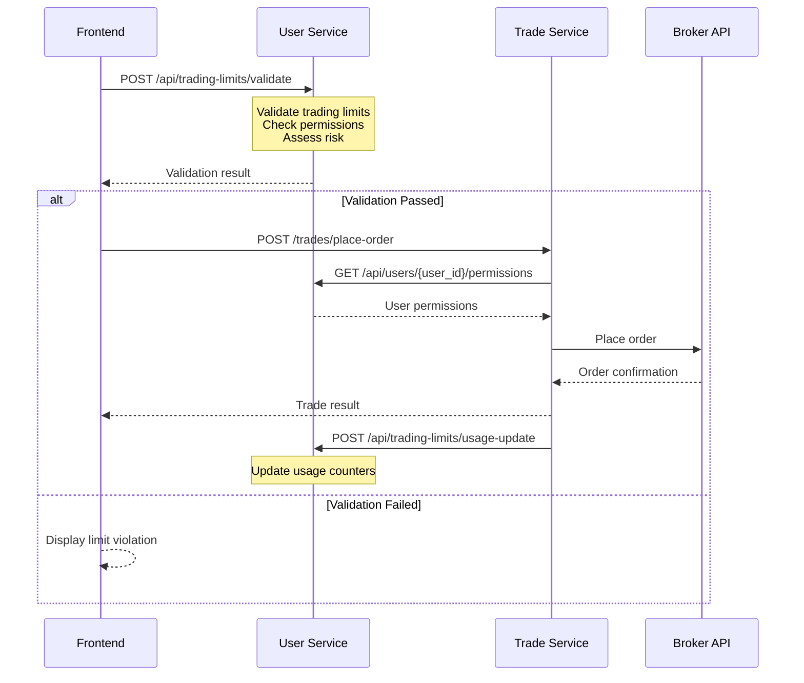

# Service Architecture Design: User Service ↔ Trade Service

## Current Architecture Overview

### Service Boundaries

#### **User Service** (Port: 8002)
**Core Responsibilities:**
- 🔐 User authentication & authorization (Keycloak integration)
- 👥 Organization & user management
- 🛡️ Trading limits & permissions enforcement
- 🔑 API key management for broker access
- 📊 User activity monitoring & analytics

**API Endpoints:**
- `/auth/*` - Authentication & JWT management
- `/users/*` - User profile management
- `/groups/*` - Organization management
- `/api/trading-limits/*` - Trading limits & risk management

#### **Trade Service** (Port: 8004)
**Core Responsibilities:**
- 📈 Trade execution & order management
- 💹 Market data synchronization
- 📊 Position & holdings management
- 🔗 Broker API integration (AutoTrader)
- 📱 Real-time trading operations

**API Endpoints:**
- `/trades/*` - Trade execution
- `/execute/*` - Order placement
- `/status/*` - Order & position status
- `/fetch_and_store/*` - Data synchronization

## Service Interaction Design

### 1. Pre-Trade Validation Flow



### 2. Service Communication Patterns

#### **Synchronous Communication (HTTP APIs)**

**User Service → Trade Service:**
```http
# Get trading account positions
GET /trade-service/api/positions?trading_account_id=123
Authorization: Service-Token <jwt>

# Get current orders count
GET /trade-service/api/orders/count?user_id=456&date=today
Authorization: Service-Token <jwt>
```

**Trade Service → User Service:**
```http
# Validate user permissions
GET /user-service/api/permissions/validate?user_id=123&action=place_order
Authorization: Service-Token <jwt>

# Update usage after trade
POST /user-service/api/trading-limits/update-usage
Authorization: Service-Token <jwt>
{
  "user_id": 123,
  "trading_account_id": 456,
  "trade_value": 50000.00,
  "action_type": "place_order"
}
```

#### **Asynchronous Communication (Event-Driven)**

**Message Queue Topics:**
- `user.permissions.updated` - User permissions changed
- `user.limits.breached` - Trading limit violated
- `trade.executed` - Trade completed successfully
- `trade.failed` - Trade execution failed
- `alert.critical` - Critical system alerts

### 3. Data Ownership Model

#### **User Service Owns:**
- ✅ User profiles & authentication
- ✅ Organizations & group memberships
- ✅ Trading limits & permissions
- ✅ API keys (hashed) for broker access
- ✅ User activity logs & audit trails

#### **Trade Service Owns:**
- ✅ Trading accounts & broker connections
- ✅ Orders, positions, & holdings data
- ✅ Market data & price feeds
- ✅ Trade execution logs
- ✅ Broker API interactions

#### **Shared Data (Read-Only Access):**
- 📖 User → Trading Account mappings
- 📖 Organization → Trading Account relationships
- 📖 Basic user information for trade attribution

## Alerting & Monitoring Architecture

### 1. Alert Categories

#### **Trading Limits Alerts** (User Service)
```json
{
  "alert_type": "trading_limit_breach",
  "severity": "high",
  "user_id": 123,
  "organization_id": 456,
  "limit_type": "daily_trading_limit",
  "breach_amount": 25000.00,
  "current_usage": 75000.00,
  "limit_value": 50000.00,
  "timestamp": "2024-01-15T14:30:00Z",
  "actions_required": ["restrict_trading", "notify_admin"]
}
```

#### **Trade Execution Alerts** (Trade Service)
```json
{
  "alert_type": "trade_execution_failed",
  "severity": "medium",
  "user_id": 123,
  "trading_account_id": 456,
  "order_id": "ORD123456",
  "failure_reason": "insufficient_margin",
  "retry_count": 2,
  "timestamp": "2024-01-15T14:35:00Z"
}
```

#### **System Health Alerts** (Both Services)
```json
{
  "alert_type": "service_degraded",
  "severity": "critical",
  "service": "trade_service",
  "component": "broker_api_connection",
  "error_message": "AutoTrader API timeout",
  "timestamp": "2024-01-15T14:40:00Z",
  "impact": "trade_execution_blocked"
}
```

### 2. Alert Routing

```yaml
Alert Routing Matrix:
├── User Service Alerts
│   ├── Limit Breaches → Organization Admin + User
│   ├── Authentication Issues → Security Team
│   └── Permission Changes → Audit Log
├── Trade Service Alerts  
│   ├── Trade Failures → User + Support Team
│   ├── Broker API Issues → Technical Team
│   └── Market Data Issues → Operations Team
└── Cross-Service Alerts
    ├── Communication Failures → DevOps Team
    ├── Data Sync Issues → Data Team
    └── Performance Degradation → Site Reliability Team
```

### 3. Alert Delivery Mechanisms

**Immediate Alerts (< 1 minute):**
- 🚨 WebSocket push notifications to UI
- 📧 Email alerts for critical breaches
- 📱 SMS for system-wide outages
- 🔔 Slack notifications for operations team

**Batch Alerts (Daily/Weekly):**
- 📊 Usage summary reports
- 📈 Performance analytics
- 🏥 Health check summaries
- 📋 Audit reports

## Failure Scenarios & Resilience

### 1. User Service Down

**Impact:**
- ❌ New user authentication blocked
- ❌ Trading limit validation unavailable
- ❌ Permission checks fail
- ✅ Existing authenticated users can trade (cached tokens)

**Mitigation Strategies:**
```python
# Trade Service fallback behavior
@handle_user_service_unavailable
async def validate_user_permissions(user_id: int, action: str):
    try:
        # Primary: Call user service
        return await user_service_client.validate_permissions(user_id, action)
    except UserServiceUnavailableError:
        # Fallback: Use cached permissions (with TTL)
        cached_permissions = await get_cached_permissions(user_id)
        if cached_permissions and not cached_permissions.is_expired():
            logger.warning(f"Using cached permissions for user {user_id}")
            return cached_permissions
        
        # Last resort: Allow basic trading with reduced limits
        logger.error(f"No permissions available for user {user_id}, using emergency limits")
        return EmergencyPermissions(
            daily_limit=10000.00,  # Conservative limit
            single_trade_limit=2000.00,
            allowed_actions=["place_order", "cancel_order"]
        )
```

### 2. Trade Service Down

**Impact:**
- ❌ Order placement blocked
- ❌ Position updates stopped
- ❌ Market data synchronization halted
- ✅ User management continues normally
- ✅ Limit validation works with stale data

**Mitigation Strategies:**
```python
# User Service behavior
@handle_trade_service_unavailable  
async def validate_trading_limits(user_id: int, action: TradingAction):
    try:
        # Get current positions from trade service
        current_positions = await trade_service_client.get_positions(user_id)
    except TradeServiceUnavailableError:
        # Use last known positions (with staleness warning)
        current_positions = await get_cached_positions(user_id)
        if current_positions.is_stale():
            return ValidationResult(
                allowed=False,
                error="Trade service unavailable - cannot validate current positions",
                suggested_action="retry_later"
            )
    
    # Continue with validation using available data
    return validate_against_limits(user_id, action, current_positions)
```

### 3. Communication Failures

**Circuit Breaker Pattern:**
```python
from shared_architecture.utils.circuit_breaker import CircuitBreaker

class InterServiceClient:
    def __init__(self):
        self.circuit_breaker = CircuitBreaker(
            failure_threshold=5,
            recovery_timeout=30,
            expected_exception=RequestTimeout
        )
    
    @circuit_breaker
    async def call_remote_service(self, endpoint, data):
        # Service call with automatic circuit breaking
        pass
```

**Message Queue Resilience:**
```python
# Durable message queues for critical events
await publish_message(
    topic="user.limits.breached",
    message=breach_data,
    delivery_mode=2,  # Persistent
    retry_policy={
        "max_retries": 3,
        "backoff_multiplier": 2,
        "max_delay": 300
    }
)
```

## Implementation Recommendations

### 1. Service-to-Service Authentication

```python
# shared_architecture/auth/service_auth.py
class ServiceAuthenticator:
    """Handle service-to-service authentication"""
    
    async def create_service_token(self, service_name: str) -> str:
        """Create JWT token for service-to-service calls"""
        payload = {
            "service": service_name,
            "iss": "stocksblitz-platform",
            "aud": ["user_service", "trade_service"],
            "exp": datetime.utcnow() + timedelta(hours=1),
            "scope": ["inter_service_communication"]
        }
        return jwt.encode(payload, self.service_secret, algorithm="HS256")
    
    async def validate_service_token(self, token: str) -> ServiceContext:
        """Validate incoming service token"""
        try:
            payload = jwt.decode(token, self.service_secret, algorithms=["HS256"])
            return ServiceContext(
                service_name=payload["service"],
                scopes=payload.get("scope", [])
            )
        except jwt.InvalidTokenError:
            raise UnauthorizedServiceError("Invalid service token")
```

### 2. Event-Driven Architecture

```python
# shared_architecture/events/event_publisher.py
class EventPublisher:
    """Centralized event publishing"""
    
    async def publish_limit_breach(self, breach_data: dict):
        """Publish trading limit breach event"""
        event = {
            "event_type": "trading_limit_breached",
            "timestamp": datetime.utcnow().isoformat(),
            "source_service": "user_service",
            "data": breach_data
        }
        
        # Publish to multiple channels
        await self.rabbitmq_publisher.publish("alerts.critical", event)
        await self.websocket_publisher.broadcast("limit_breach", event)
        await self.email_publisher.send_alert(event)
    
    async def publish_trade_completed(self, trade_data: dict):
        """Publish successful trade event"""
        event = {
            "event_type": "trade_executed",
            "timestamp": datetime.utcnow().isoformat(),
            "source_service": "trade_service", 
            "data": trade_data
        }
        
        await self.rabbitmq_publisher.publish("trades.completed", event)
        # Trigger usage update in user service
        await self.http_client.post(
            "user_service/api/trading-limits/update-usage",
            json=trade_data
        )
```

### 3. Data Consistency Patterns

**Eventual Consistency for Non-Critical Data:**
```python
# Usage statistics can be eventually consistent
@background_task
async def sync_usage_statistics():
    """Periodic sync of usage data between services"""
    trade_summary = await trade_service.get_daily_summary()
    user_service.update_usage_counters(trade_summary)
```

**Strong Consistency for Critical Operations:**
```python
# Two-phase approach for limit validation
async def place_order_with_limits(order_data, user_context):
    # Phase 1: Reserve limit capacity
    limit_reservation = await user_service.reserve_limit_capacity(
        user_context.user_id, order_data.trade_value
    )
    
    try:
        # Phase 2: Execute trade
        trade_result = await trade_service.place_order(order_data)
        
        # Confirm limit usage
        await user_service.confirm_limit_usage(limit_reservation.id, trade_result)
        
    except TradeExecutionError:
        # Release reserved capacity
        await user_service.release_limit_capacity(limit_reservation.id)
        raise
```

### 4. Monitoring & Observability

```python
# shared_architecture/monitoring/service_metrics.py
class ServiceMetrics:
    """Cross-service metrics collection"""
    
    def __init__(self):
        self.inter_service_calls = Counter('inter_service_calls_total', 
                                          ['source', 'target', 'endpoint', 'status'])
        self.limit_validations = Counter('limit_validations_total',
                                       ['result', 'limit_type'])
        self.trade_executions = Counter('trade_executions_total',
                                      ['status', 'user_type'])
    
    def record_service_call(self, source: str, target: str, endpoint: str, status: str):
        self.inter_service_calls.labels(
            source=source, target=target, endpoint=endpoint, status=status
        ).inc()
    
    def record_limit_validation(self, result: str, limit_type: str):
        self.limit_validations.labels(result=result, limit_type=limit_type).inc()
```

## Design Refinement Suggestions

### 1. API Gateway Pattern
Introduce an API Gateway to:
- Route requests to appropriate services
- Handle authentication at the edge
- Implement rate limiting and caching
- Provide unified API documentation

### 2. Saga Pattern for Distributed Transactions
For complex operations involving both services:
```python
class PlaceOrderSaga:
    """Orchestrate order placement across services"""
    
    async def execute(self, order_data, user_context):
        saga_id = generate_saga_id()
        
        try:
            # Step 1: Validate and reserve limits
            limit_result = await self.user_service.reserve_trading_limit(
                user_context, order_data, saga_id
            )
            
            # Step 2: Execute trade
            trade_result = await self.trade_service.place_order(
                order_data, saga_id
            )
            
            # Step 3: Confirm limit usage
            await self.user_service.confirm_limit_usage(
                limit_result.reservation_id, trade_result
            )
            
            return trade_result
            
        except Exception as e:
            # Compensating actions
            await self.compensate_saga(saga_id, e)
            raise
```

### 3. Event Sourcing for Audit Trail
Store all trading-related events for complete audit trail:
```python
class TradingEventStore:
    """Store all trading events for audit and replay"""
    
    async def append_event(self, event: TradingEvent):
        await self.event_store.append(
            stream_id=f"user-{event.user_id}",
            event_type=event.event_type,
            event_data=event.data,
            metadata={
                "service": event.source_service,
                "timestamp": event.timestamp,
                "correlation_id": event.correlation_id
            }
        )
```

### 4. Service Mesh for Communication
Consider implementing Istio or similar for:
- Automatic service discovery
- Load balancing and traffic management
- Security policies and mTLS
- Observability and distributed tracing

This architecture provides a robust, scalable foundation for the trading platform with proper separation of concerns, resilience patterns, and comprehensive monitoring.